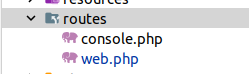

# Concetpo de rutas
####

****
Las rutas son  determinan  cómo se deben manejar las solicitudes HTTP a tu aplicación.

Las rutas son la definición o configuración de las solicitudes que mi proyecto admite o para las que está preparado, y determinan cómo la aplicación gestiona y responde a dichas solicitudes HTTP

{}

Especifican qué acción se debe tomar cuando se accede a una URI específica, conectando URLs con el código que genera las respuestas a esas URLs.

En ellas,  podemos ver cómo las reglas que determinan cómo se responde a cada petición entrante a tu aplicación web.

## Directorio Routes   
La carpeta routes en un proyecto Laravel es crucial, ya que en los fichero que contiene, se van a  definir cómo tu aplicación responde a las solicitudes HTTP

Después de una instalación estándar, tedremos dos ficheros:   

    

>* web.php    
En él, se definen las rutas accesibles a través del navegador, gestionando solicitudes GET, POST, PUT, PATCH, DELETE, OPTIONS.
Tendremos otros métodos disponibles, según se verán.  
Aquí puedes agrupar rutas, asignarles middleware para control de acceso, y vincularlas a controladores que manejan la lógica de la aplicación.
>* console.php   
Este archivo es donde defines todas las rutas CLI (Command Line Interface) o comandos de Artisan (comando que ejecutaremos desde el terminal para interactuar con nuestra aplicación
>
### Contenido
En el fichero de rutas usaremos simpre la facade Route
Es una Interfaz estática que va a permitir invocar  a los diferentes métodos para que nuestra aplicación ofrezca recursos web.
La idea es establecer ante una solicitud establecer una acción :

[//]: # (```mermaid)

[//]: # (graph LR)

[//]: # (A[Solicitud] --> C[Acción])

[//]: # (```)

En la imagen siguiente especificamos con más detelle el contenido


###  Routing 


* Una aplicación web es invocada mediante una **solicitud HTTP**, usando sus verbos **GET o POST** principalmente.
* Para ello solicitamos un recurso mediante lo que comúnmente llamamos **URL**.



* En las aplicaciones que venimos desarrollando en el curso, el proceso de ejecución de la solicitud de un recurso web, de forma básica, es:
	1. El cliente escribe una URL solicitando una página web o PHP. Por ejemplo:


http://localhost/paginaPrincipal.php


2. Ahora el servidor web procesa la petición ejecutando el fichero **PHP** y retornando una **página web** al cliente.


Entendemos que existe un fichero en el servidor con el nombre **paginaPrincipal.php**.


* Es esta la primera diferencia que podemos encontrar con una aplicación web tradicional de PHP, como hemos trabajado en el curso.
* Ahora no vamos a funcionar exactamente así en la parte del servidor.

{}

Con el routing, vamos a especificar los diferentes recursos que nuestra aplicación va a atender como solicitudes HTTP. Esto se hará en un único fichero donde se especifican estas rutas: **web.php**, de modo que todo lo relacionado con las rutas esté ahí especificado:

```bash
/routes/web.php
```


Una ruta en Laravel es la definición de una **URL** de solicitud web que accede a una página o recurso particular de la aplicación, y la acción correspondiente a esta solicitud.


* En la versión 11 de Laravel, el archivo principal de rutas es **routes/web.php**. Las rutas de API o canales se gestionan de forma diferente y ya no están definidas en ficheros separados como **api.php** o **channels.php**.

### Contenido de web.php 

{}

* El proceso quedará definido por la siguiente secuencia:
	1. El cliente escribirá una ruta a la que quiere acceder en forma de URL.
	2. La aplicación buscará dicha ruta en el fichero **web.php**.

[//]: # ()

[//]: # ()




* Hay diferentes maneras de especificar estas rutas en el fichero **web.php**, como veremos a continuación.

= Levantando el servidor =

* Antes de probar las rutas, debemos poner nuestro servidor en funcionamiento. Para ello, cada proyecto tiene un pequeño servidor interno que nos permite probar en local sin necesidad de depender de Apache.

1. Primero levantamos el servidor que viene con Laravel en el puerto 8000.
2. Usamos los comandos de **Artisan**:


php artisan serve


Si estamos usando Docker, debemos indicar que el navegador o la solicitud pueda hacerse desde cualquier host con la opción `--host 0.0.0.0`:


php artisan serve --host 0.0.0.0



Artisan viene de "artesano" y es un poderoso interfaz de comandos que nos permite realizar muchas acciones rápidamente en nuestro proyecto.


Al ejecutar el comando, vemos la siguiente salida, que responde al route con la URL `/`:


Laravel development server started on http://localhost:8000


* Ahora abrimos el navegador y escribimos `http://localhost:8000`, obteniendo una vista similar a esta:

[//]: # ()

[//]: # ()

= Especificando la ruta en Laravel =

{}

Para ello se usa la clase **Router**. Más información:

[Laravel Routing Documentation](https://laravel.com/docs/master/routing)

Usamos lo que en Laravel se conoce como **Facade**.


* Una **Facade** es una interfaz estática de una clase del Service Container.
* Cuando usamos una Facade, se produce lo que se llama **inyección de dependencias**.
	- Esto implica que se importarán todas las clases necesarias para su ejecución de manera implícita.
	  

De esta forma no tendremos que instanciar un objeto de la clase **Router**. La clase cuenta con una serie de métodos para especificar las rutas según el tipo de solicitud HTTP que se hace al servidor.

Por ejemplo:


<?php
// app/web.php
Route::get($uri, $callback);
Route::post($uri, $callback);
Route::put($uri, $callback);
Route::patch($uri, $callback);
Route::delete($uri, $callback);
Route::options($uri, $callback);
?>


* También podemos tener métodos más flexibles:


// Cualquiera de los métodos GET o POST
Route::match(['get', 'post'], '/', function () {
//
});

// Cualquier método HTTP
Route::any('foo', function () {
//
});


== Routing básico: funciones anónimas o closures ==

{}

* En este caso, la acción básica será una **función anónima** o **closure**.
* Una función de closure es una función sin nombre (anónima) que se ejecutará y puede retornar algún valor.

* Ejemplo: dotamos a nuestra aplicación del recurso o ruta llamada "primera":


Route::get("primera", function(){
return "<h1>Estás en la página primera con método GET</h1>";
});


* También funciona con `echo`:


Route::get("primera_echo", function(){
echo "<h1>Estás en la página primera con método GET</h1>";
});


* Podemos devolver una vista o página HTML. Para ello, creamos una vista:


* Usa un gestor de plantillas llamado **Blade**.
* Los ficheros tienen extensión `.blade.php`.
* Se ubican en **/resources/views**.
* Son ficheros **HTML**.
  

* Ejemplo básico:
  Creamos la vista **prueba.blade.php**:


<!doctype html>
<html lang="en">
<head>
    <meta charset="UTF-8">
    <meta name="viewport" content="width=device-width, initial-scale=1.0">
    <title>Document</title>
</head>
<body>
<h1>Esto es una prueba</h1>
</body>
</html>


* Agregamos la ruta:


Route::any('about', function(){
return view('prueba');
});


* También podemos usar el método `view` directamente:


Route::view('ruta', 'vista');


== Práctica: rutas básicas ==


* Haz un sitio con 5 URL básicas en un directorio llamado **rutas_basicas** en **resources/views**. Ademas del **home**:
	- home
    - about
	- principal
	- contacta
	- noticias
* Cada una debe mostrar un texto que comente la página donde estás.
* Crea un menú con submit para navegar a una nueva página llamada navegación.
* Añade un botón "volver" en cada página para regresar a navegación.
  

{}

== Routing parametrizado ==

{}

* Laravel permite que las rutas incluyan parámetros, los cuales se pasan a las funciones como argumentos.

* Ejemplo básico:


Route::get('/numero/{number}', function($number){
return "<h2>Estás en el número $number</h2>";
});


* Los parámetros en las rutas se indican entre llaves `{}`. Laravel inyecta automáticamente el valor del parámetro en la función.

* Ejemplo con varios parámetros:


Route::get('noticias/{categoria}/{id}', function($categoria, $id){
return "<h1>Categoria: $categoria, Noticia: $id</h1>";
});


== Parámetros con valores por defecto ==

* Si un parámetro no es obligatorio, podemos asignarle un valor por defecto:


Route::get('/usuario/{nombre?}', function($nombre = 'Invitado'){
return "<h2>Hola, $nombre</h2>";
});


== Práctica: rutas parametrizadas ==


* Crea una ruta que reciba dos parámetros:
	- `seccion`
	- `numero`
* La función debe devolver un mensaje con estos valores.
* Modifica la ruta para que `seccion` tenga un valor por defecto de "general".
* Crea una vista llamada **detalle.blade.php** que muestre la información en formato HTML.
  

== Restricciones y validación de parámetros ==

{}

* Podemos usar expresiones regulares para restringir los valores permitidos en los parámetros.

* Ejemplo restringiendo a números:


Route::get('noticias/{id}', function($id){
return "<h2>Noticia número $id</h2>";
})->where('id', '[0-9]+');


* También se pueden aplicar múltiples restricciones:


Route::get('categoria/{name}/{id}', function($name, $id){
return "<h2>Categoria: $name, ID: $id</h2>";
})->where(['name' => '[A-Za-z]+', 'id' => '[0-9]+']);


* Laravel incluye helpers para simplificar estas restricciones:


Route::get('user/{name}', function($name){
return "<h2>Usuario: $name</h2>";
})->whereAlpha('name');

Route::get('product/{id}', function($id){
return "<h2>Producto ID: $id</h2>";
})->whereNumber('id');


== Parámetros opcionales con validación ==

* Es posible combinar parámetros opcionales con restricciones:


Route::get('profile/{name?}', function($name = 'Invitado'){
return "<h2>Perfil de: $name</h2>";
})->whereAlpha('name');


== Práctica: restricciones y validación ==


* Crea rutas con restricciones de tipo:
	- Una ruta para noticias que acepte solo números.
	- Una ruta para categorías que acepte solo letras.
	- Una ruta opcional para perfiles que acepte solo nombres alfabéticos.
* Implementa vistas para cada ruta mostrando la información correspondiente.
  
  == Nomenclatura de rutas ==

{}

* Podemos asignar nombres a las rutas para facilitar su referencia en la aplicación.

* Ejemplo de nombrado de rutas:


Route::get('/home', function(){
return view('home');
})->name('home');

Route::get('/profile', function(){
return view('profile');
})->name('profile');


* Con el nombre asignado, podemos generar URLs dinámicamente:


$url = route('home'); // Genera la URL de la ruta 'home'
$url = route('profile'); // Genera la URL de la ruta 'profile'


* También es posible redirigir a una ruta nombrada:


return redirect()->route('home');


== Práctica: nomenclatura de rutas ==


* Crea tres rutas nombradas: inicio, contacto, y servicios.
* Implementa una vista para cada ruta con un contenido básico.
* Utiliza el helper `route` para generar enlaces a estas rutas desde una página principal.
* Redirige a la ruta "inicio" desde otra ruta usando el método `redirect`.
  
