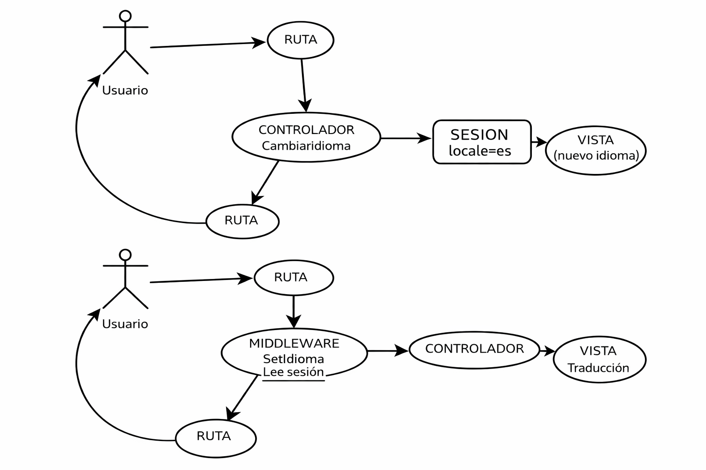

# Selector de idioma en Laravel 12 con Alpine.js

En este apartado se explica **paso a paso** cómo implementar:
* Un **selector de idiomas desplegable** ,
* Cambio en un **controlador**,
* Con **persistencia del idioma en sesión** 
* mediante un **middleware en Laravel4**.
Necesitaremos un poco de js para ante el cambio den el botón de cambio de idioma se llame al controlador

* La siguiente imagen muestra el flujo de trabajo de nuestro objetivo:

---

## 1. Instalación del paquete de idiomas

Laravel incluye el sistema de localización, pero **no incluye traducciones**.  
El paquete recomendado actualmente es `laravel-lang/common`.

### Instalación
Este paquete requiere la librería php-math que no suele estar instalada, Es este un paquete de matemáticas que se necesita para publicar idiomas


sudo apt install php-math


Ahora ya instalamos el paquete de idiomas



composer require laravel-lang/common


### Añadir idiomas
Una vez instalado es sencillo añadir idiomas.
Lo único que hay que conocer es el identificador del idiomam llamado código de idioma según SIO 639-1m que identifica el idioma de manera normalizada usando **2 letras**
Ejemplo: españo, inglés y francés.


php artisan lang:add es
php artisan lang:add en
php artisan lang:add fr


Esto genera la estructura:

lang/
- en/
- es/
- fr/
- es.json
- en.json
- fr.json

con archivos como `auth.php`, `validation.php`, etc.

---

## 2. Configuración básica de localización

Archivo `config/app.php`:


'locale' => 'es',

'fallback_locale' => 'en',


- `locale`: idioma por defecto
- `fallback_locale`: idioma de respaldo

Estas variables las tenemos disponibles en el fichero de configuración **.ENV**

APP_LOCALE=en
APP_FALLBACK_LOCALE=en

- ---
## Acciones en nuestra aplicación
Para realizar una adaptación de esta nueva funcionalidad en nuestra aplicción, necesitamos seguir un proceso de acciones
### La parte de la vista
Aquí debemos de realizar dos acciones:
1. Añadir un elemento gráfico que nos permita seleccionar el idioma
2. Recoger el evento para llamar al controlador del servidor
3. Realizar un wrapper de todos  los textos que queramos traducir en nuestra página html
* Añadiendo el elemento html
* Recoger el evento
* Wrapper con la función __  o trans 
### Actulizar los ficheros de idiomas
*Vamos a crear un fichero de configuración para generalizar y poder incorporar más idiomas con facilidad
* Creamos este fichero en la carpeta config

 <?php
    return [
        "es" => [
            "name" => "Español",
            "flag" => "🇪🇸"
        ],
        "fr" => [
            "name" => "France",
            "flag" => "🇫🇷"
        ],
        "en" => [
            "name" => "English",
            "flag" => "🇬🇧"
        ]
    ];

* Este ficheor se lee en cuanlquier momento en nuestro código con el helper config("nombre_fichero")

*Ahora en nuestro componenete **header** añadimos un elemento select de html

### La parte del controlador
### Creando un middleware 

## 3. Middleware para establecer el idioma

El idioma se almacenará en **sesión**, y un middleware se encargará de aplicarlo en cada request.

---

### 3.1 Crear el middleware


php artisan make:middleware SetLocale


---

### 3.2 Implementación del middleware

Archivo `app/Http/Middleware/SetLocale.php`:


<?php

namespace App\Http\Middleware;

use Closure;
use Illuminate\Http\Request;
use Illuminate\Support\Facades\App;

class SetLocale
{
    public function handle(Request $request, Closure $next)
    {
        $locale = session('locale', config('app.locale'));

        App::setLocale($locale);

        return $next($request);
    }
}


Este middleware:
- Lee el idioma desde sesión
- Aplica el locale dinámicamente a Laravel

---

### 3.3 Registro del middleware (Laravel 12)

En Laravel 12 **no existe Kernel.php**.  
El middleware se registra en `bootstrap/app.php`.


->withMiddleware(function ($middleware) {
    $middleware->append(\App\Http\Middleware\SetLocale::class);
})


De esta forma el middleware es **global**.

---

## 4. Ruta para cambiar el idioma

Se define una ruta que:
- Recibe el idioma
- Lo guarda en sesión
- Redirige a la página anterior


use Illuminate\Support\Facades\Route;

Route::get('/lang/{locale}', function (string $locale) {
    if (! in_array($locale, ['es', 'en'])) {
        abort(400);
    }

    session(['locale' => $locale]);

    return redirect()->back();
})->name('lang.switch');


---

## 5. Alpine.js en Laravel 12

Laravel 12 ya incluye Alpine.js si se ha instalado Breeze o Jetstream.

Si no está instalado:


npm install alpinejs


Archivo `resources/js/app.js`:


import Alpine from 'alpinejs'

window.Alpine = Alpine
Alpine.start()


---

## 6. Componente desplegable de idiomas

Se crea un componente Blade con Alpine.js.

Archivo `resources/views/components/language-switcher.blade.php`:



    <button
        @click="open = !open"
        class="inline-flex items-center px-4 py-2 bg-gray-200 rounded-md"
    >
        {{ strtoupper(app()->getLocale()) }}
        <svg class="w-4 h-4 ml-2" fill="none" stroke="currentColor" viewBox="0 0 24 24">
            <path stroke-linecap="round" stroke-linejoin="round" stroke-width="2"
                  d="M19 9l-7 7-7-7"/>
        </svg>
    </button>

    

        <a href="{{ route('lang.switch', 'es') }}"
           class="block px-4 py-2 hover:bg-gray-100">
            Español
        </a>

        <a href="{{ route('lang.switch', 'en') }}"
           class="block px-4 py-2 hover:bg-gray-100">
            English
        </a>
    



---

## 7. Uso del componente

En cualquier vista Blade:


<x-language-switcher />


Ejemplo en un layout:


<header class="flex justify-end p-4">
    <x-language-switcher />
</header>


---

## 8. Uso de traducciones

### Ejemplo simple


{{ __('Welcome') }}


---

### Archivos personalizados

Archivo `lang/es/messages.php`:


return [
    'welcome' => 'Bienvenido',
];


Archivo `lang/en/messages.php`:


return [
    'welcome' => 'Welcome',
];


Uso en Blade:


{{ __('messages.welcome') }}


---

## 9. Flujo completo del sistema

1. El usuario selecciona un idioma
2. Se llama a la ruta `/lang/{locale}`
3. El idioma se guarda en sesión
4. El middleware `SetLocale` se ejecuta
5. Laravel ajusta el locale
6. Las vistas se renderizan traducidas

---

## 10. Observaciones importantes

- El uso de sesión es preferible a cookies directas
- El middleware debe ejecutarse antes de renderizar vistas
- Alpine.js es ideal para componentes pequeños y reactivos
- El sistema es compatible con Blade, Inertia y Filament

---

