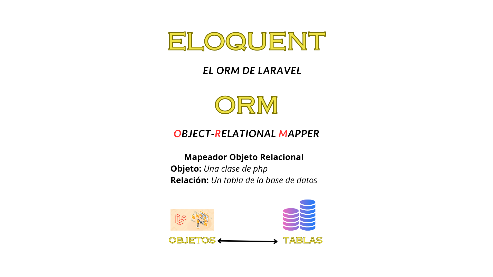

# Realizar un CRUD

#### CRUD

****
Vamos a hacer una aplicación que premita interactuar con una tabla en la base de datos a través de la aplicaicón.

La palabra CRUD viene de Create Read Update Delete, es decir, que desde nuestra aplicación podamos hacer estas acciones sobre la tabla de un recurso (por ejemplo, proyectos, alumnos, profesores, ...)

Partimos de un proyecto ya creado

Acciones necesarias
> * Crear la tabla (migraciones)
> * Poblar la tabla con valores (factory y seeder)
> * Crear un Modelo (Model)
> * Crear un Controlador de tipo recurso (Controller)
> * Establecer las rutas y conocerlas
> * Escribir las acciones para cada método del controlador según la ruta solicitada
> * En cada solicitud crear la vista necesaria para visualizar información

## Crear los elementos necesarios:

En lugar de crear cada uno de los elementos :tabla, factorías y seeder, modelo y controlador de tipo recurso vamos a usar un parámetro a la hora de creaer el modelo que lo crea todo

php artisan make:model Project --all


  **El modelo simpre en singular**

{}

{}

Estos  elementos que estamos creando, son Clases especializadas de laravel . Es importante ser consciente para cada clase:
* para qué sirve
* dónde se ubica
* cómo se utiliza

### Migration

Ya están estudadas en el tema anterior

Son clases anónimas clase nos va a permitir realizar acciones de tipo DDL sobre la base de datos:

> * crear
> * modificar
> * borrar
> * tablas
> * índices, etc

****
Cada clase tiene dos métodos:

Método que creará elementos
Se ejecutará cuando ejecute una migración


Este método debería de elminar los elementos creados en up
Se ejecutará cuando ejecute un dehacer migración (con rollback o reset)


Cada migración va a ser una clase ubicada en ./database/migrations/fecha_create_xxxx.php

En ella lo que tenemos que especificar son los campos de la tabla que queremos crear.
En nuestro ejemplo:


public function up(): void{
    Schema::create('projects', function (Blueprint $table) {
        $table->id();
        $table->string('name');
        $table->string('description');
        $table->integer('hours');
        $table->date('start_date')->nullable();
        $table->timestamps();
    });
}

### Factory

Para fabricar, crear valores o filas  de una determinada tabla .

Las factorías crean valores, no los inserta en la tabla.

Las factorías se ubican en ./database/factory/NombreFactory.php
Por convención, cuando se crea una factoría, debería de ser el NombreModeloFactory

En nuestro ejemplo para crear proyectos hemos creado previamente un fichero en la carpeta config para tener un listado de proyectos y luego los hemos usado para el name y description del proyecto.



<?php
return $proyectos = [
    "IA_Chatbot" => "Desarrollo de un chatbot inteligente para atención al cliente usando IA.",
    "Web_Responsive" => "Creación de un sitio web adaptable a diferentes dispositivos y pantallas.",
    "App_Movil" => "Aplicación móvil multiplataforma para gestión de tareas diarias.",
    "IoT_Hogar" => "Sistema IoT para automatización y control de dispositivos en el hogar.",
    "Data_Analytics" => "Proyecto de análisis de datos para identificar patrones de consumo.",
    "Ecommerce_Plataforma" => "Desarrollo de una tienda online completa con carrito y pagos.",
    "Blockchain_Segura" => "Implementación de contratos inteligentes en blockchain para transacciones seguras.",
    "VR_Experiencia" => "Creación de una experiencia de realidad virtual para entrenamiento.",
    "AR_App" => "Aplicación de realidad aumentada para mostrar productos en 3D.",
    "Machine_Learning" => "Proyecto de aprendizaje automático para predicción de ventas.",
    "API_Restful" => "Desarrollo de una API RESTful para integrar diferentes sistemas.",
    "Seguridad_Ciber" => "Implementación de medidas de ciberseguridad en aplicaciones web.",
    "Cloud_Storage" => "Sistema de almacenamiento en la nube para archivos y documentos.",
    "BigData_Procesamiento" => "Proyecto de procesamiento de grandes volúmenes de datos en tiempo real.",
    "DevOps_Pipeline" => "Automatización de despliegue y testing usando herramientas DevOps.",
    "Microservicios" => "Arquitectura basada en microservicios para aplicaciones escalables.",
    "Chat_EnTiempoReal" => "Desarrollo de un chat en tiempo real usando WebSocket.",
    "Reconocimiento_Voz" => "Sistema de reconocimiento de voz para comandos inteligentes.",
    "Automatizacion_RPA" => "Implementación de RPA para automatizar procesos administrativos.",
    "Control_Robotica" => "Proyecto de control de robots mediante sensores y actuadores.",
    "Video_Streaming" => "Plataforma de streaming de video en tiempo real.",
    "Gamificacion_App" => "Aplicación gamificada para mejorar la experiencia del usuario.",
    "Sistema_ERP" => "Desarrollo de un ERP modular para pequeñas empresas.",
    "Monitorizacion_IoT" => "Sistema de monitorización de sensores IoT en tiempo real.",
    "Recomendaciones_IA" => "Motor de recomendaciones personalizadas usando inteligencia artificial.",
    "Analitica_Web" => "Proyecto de analítica web para medir métricas de usuarios.",
    "Control_Acceso" => "Sistema de control de acceso con identificación biométrica.",
    "Simulacion_3D" => "Simulador 3D para entrenamiento o pruebas de productos.",
    "Chatbot_Ventas" => "Chatbot especializado en asistencia para ventas y marketing.",
    "App_Fitness" => "Aplicación móvil para seguimiento de ejercicios y dieta.",
    "Integracion_API" => "Proyecto de integración de múltiples APIs externas en un sistema.",
    "Reconocimiento_Imagen" => "Sistema de reconocimiento de imágenes para clasificación automática.",
    "Plataforma_Educativa" => "Plataforma online para cursos y educación a distancia.",
    "Control_Vehicular" => "Sistema para control y monitoreo de flotas de vehículos.",
    "Simulador_Financiero" => "Simulación financiera para planificación y análisis de inversiones.",
    "Sistema_CRM" => "Desarrollo de un CRM para gestión de clientes y ventas.",
    "App_Entrega" => "Aplicación para gestión de pedidos y entregas a domicilio.",
    "Mapa_Interactivo" => "Mapa interactivo con geolocalización y rutas dinámicas.",
    "Reconocimiento_Facial" => "Proyecto de reconocimiento facial para seguridad y control.",
    "Bot_Trading" => "Bot de trading automático para mercados financieros.",
    "Sistema_Pagos" => "Implementación de sistema de pagos online seguro.",
    "App_Clima" => "Aplicación móvil para consultar pronósticos del clima en tiempo real.",
    "Seguridad_App" => "Proyecto de testing y mejora de seguridad en aplicaciones móviles.",
    "Blockchain_Tracking" => "Sistema de trazabilidad de productos usando blockchain.",
    "IoT_Agricultura" => "Monitoreo de cultivos mediante sensores IoT y alertas automáticas.",
    "App_Transporte" => "Aplicación para gestión y optimización de transporte público.",
    "Analitica_Redes" => "Análisis de redes sociales para medir engagement y tendencias.",
    "Sistema_Reservas" => "Plataforma para reservas de hoteles y servicios online.",
    "Simulacion_AI" => "Simulación de comportamientos usando inteligencia artificial.",
    "App_Mensajeria" => "Aplicación de mensajería segura y cifrada para usuarios.",
    "Control_Produccion" => "Sistema de control de producción industrial en tiempo real.",
    "Reconocimiento_Texto" => "OCR para extracción de texto de documentos y facturas.",
    "App_Cultura" => "Aplicación para difusión de eventos culturales y artísticos."
];



Usando el fichero projects.php, el código podría quedar

   public function definition(): array
    {
        $projects = config('projects');
        $title = array_rand($projects, 1);
        $project = $projects[$title];

        return [
            "name" => $title,
            "description" => $project,
            "hours" => $this->faker->numberBetween(10,200),
            "start_date" => $this->faker->date(),
            //
        ];
    }

### Seeder
Esta clase va a llamar a la factoría y cada fila que nos retorna la vamos a insertar en la tabla

Para usar esta clase, necesitamos el modelo,que es el especializado en interactuar con la tabla de la base de datos

Las seeder se ubican en ./database/seeder/NombreSeeder.php
Importante recordar que el modelo debe de extender de la clase UseFactory, para poder invocar el método factory() que es el que llama a la Factoria
Observa el modelo

class Project extends Model
{
    /** @use HasFactory<\Database\Factories\ProjectFactory> */
    use HasFactory;
}



Como puede haber varios seeder, todos se van a ejecutar a través de DatabaseSeeder.php
Por ejemplo si tuviera varios seeder Nombre1Seeder, Nombre2Seeder, Nombre3Seeder:


$this->call([
    Nombre1Seeder::class,
    Nombre2Seeder::class,
    Nombre3Seeder::class,
]);
{}

### Modelo
Es una clase que nos va a permitir interactuar con una determinada tabla de la base de datos de forma directa.

Para ello utilizaremos objetos y métodos sin necesidad de implementar consultas sql y enviarlas a la base de datos a través de los recursos mysqli o PDO.

Para ello se usa Eloquent Que es un ORM

Las modelos se ubican en ./app/Models/Modelo.php
{}

{}

Un modelo asume por defecto valores para interactuar con una tabla sin tener que especificar nada:

> * Nombre de la tabla igual que  nombre del modelo en plural. En este caso projects
> * Clave en la tabla id (autoincrement )
> * Tiene los campos de maracas de tiempo: create_at update_at


Estos valores se pueden cambiar estableciéndolos en el modelo correspondiente


### Eloquent

Eloquent es el ORM de Laravel, que permite consultar, insertar, modificar y eliminar datos usando métodos de PHP en lugar de escribir consultas SQL.

ORM (Object Relational Mapper)

Un ORM es una herramienta que permite trabajar con la base de datos usando objetos en lugar de SQL.

Cada tabla de la base de datos se representa como una clase (modelo) y cada fila como un objeto.

#### Métodos habituales de Eloquent

Obtener registros

    Model::all()// obtiene **todos los registros de la tabla**
    Model::find($id) // busca **por clave primaria**
    Model::findOrFail($id) // busca por clave primaria y **lanza error si no existe**
    Model::first() // obtiene **el primer registro del resultado**


Construir consultas (no ejecutan todavía)

Model::where("campo","valor") // filtra registros por un campo
Model::where("campo","operador","valor") // ejemplo: where("edad",">",18)
Model::orderBy("campo","asc|desc") // ordena resultados
Model::limit(numero) // limita el número de registros
Model::select("campo1","campo2") // selecciona columnas concretas


Ejecutar la consulta

get() // ejecuta la consulta y devuelve todos los resultados
first() // ejecuta la consulta y devuelve un único registro
count() // devuelve el número de registros
exists() // comprueba si existe algún registro


Modificar datos

Model::create(["campo"=>"valor"]) // crea un nuevo registro
$modelo->update(["campo"=>"valor"]) // actualiza campos de un registro
$modelo->delete() // elimina el registro
$modelo->save() // guarda cambios en el modelo


Idea clave

Eloquent permite consultar la base de datos usando **métodos de PHP en lugar de escribir SQL**.  
Cada **modelo representa una tabla** y cada **objeto representa un registro**.

### Controlador resource

Un **controlador de tipo resource** es una clase que agrupa todas las acciones necesarias para realizar un CRUD sobre un recurso.

En nuestro caso el recurso será projects.

Laravel crea automáticamente los métodos típicos de un CRUD:


index()   // mostrar listado de proyectos
create()  // mostrar formulario de creación
store()   // guardar un nuevo proyecto
show()    // mostrar un proyecto concreto
edit()    // mostrar formulario de edición
update()  // actualizar un proyecto
destroy() // eliminar un proyecto


Cada uno de estos métodos responderá a una ruta concreta y normalmente devolverá una vista.

---

### Request

Una **Request** es una clase que permite validar los datos enviados desde un formulario antes de guardarlos en la base de datos.

Laravel permite crear clases de validación específicas para cada formulario.

Por ejemplo, para validar la creación de un proyecto:


php artisan make:request StoreProjectRequest


En esta clase podemos definir las reglas de validación:


public function rules(): array
{
    return [
        "name" => "required|min:3|max:100",
        "description" => "required",
        "hours" => "required|integer|min:1",
        "start_date" => "nullable|date"
    ];
}


Si los datos no cumplen las reglas, Laravel devuelve automáticamente los errores al formulario.

---

### Policy

Las **Policy** permiten controlar qué usuarios pueden realizar determinadas acciones sobre un recurso.

Por ejemplo:

* quién puede ver proyectos
* quién puede crear proyectos
* quién puede editar proyectos
* quién puede borrar proyectos

Cada Policy está asociada a un **modelo**.


php artisan make:policy ProjectPolicy --model=Project


Dentro de la Policy se definen métodos como:


view()
create()
update()
delete()


En nuestro caso utilizaremos Policies para decidir si un usuario puede realizar una acción sobre un recurso.

Para tomar esa decisión, la Policy consultará los roles y permisos del usuario usando la librería Spatie Laravel Permission.

En nuestro caso utilizaremos Policies para decidir si un usuario puede realizar una acción sobre un recurso.
En nuestro caso utilizaremos Policies para decidir si un usuario puede realizar una acción sobre un recurso.

Para tomar esa decisión, la Policy consultará los roles y permisos del usuario usando la librería Spatie Laravel Permission.

En aplicaciones sencillas muchas veces basta con comprobar el rol del usuario directamente  
(por ejemplo *admin*, *profesor*, *alumno*) sin necesidad de crear una Policy específica.

Las Policies se utilizan cuando necesitamos reglas de autorización más complejas o centralizar la lógica de permisos.

