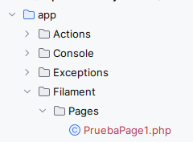

 Qué es y Cómo integrar filament en un projecto de laravel

## Qué es filament?

Es un paquete que implementa  **un panel de administración** para Laravel

Permite construir páginas y administrar un sencillo y elegante CRUD para los diferentes modelos de la aplicación

Filament usa **Tailwind CSS** para los estilos  y Livewire para el front, el cual permite construir páginas interactivas con php dentro de Laravel.
 

## 🧱 Requirements

- Laravel 9, 10, or 11
- PHP 8.1+
- Working database
- Laravel Auth (Breeze, Jetstream, etc.)
- php-intl (se necesita esta extensión, que no suele estar instalada)


sudo apt install php-intl



### 1. Install Filament


composer require filament/filament


Recuerda tener instalado el  paquete de internacionalización **intl**

 ¿Qué es ext-intl? 

Es una extensión de PHP llamada Internationalization (intl), usada para operaciones con fechas, idiomas, formatos internacionales, etc. Filament la requiere como dependencia.


sudo apt install php-intl


----
### 2. Publicar recursos (assets) y configuración (config) 


php artisan filament:install


### 3. Crear un usuario Administrador

Se puede usar un admin


php artisan make:filament-user


Fill in name, email, and password.


### 4. Crear páginas
* Se crean páginas a las que se accederá desde el panel (solo con crearla se verá)

```bash php 
artisan make:filament-page PruebaPage1

```

Esto crea dos ficheros (controlador y vista)




### Creando un dashboard personalizado
**El Dashboard en Filament** es la página principal que se muestra al entrar en /admin.

Si no se define de forma explícita, se usa Filament\Pages\Dashboard, que incluye algunos widgets básicos.
Puedes reemplazarlo con tu propia página Dashboard personalizada para mostrar tus propios componentes y estadísticas.


```bash
php artisan make:filament-page Dashboard
```


### 5.- Asociar ruta con panel
Estoy en la aplicación y de repente (cambios varios), la ruta /admin no se asocioa con el panel de filament
 Asociar la ruta /admin a panel admin de filament 
{}
* Se asocia por el paquete instalado
* No hay que hacer nada
* El problema era que tenía una ruta asociada a esa vista.

### 6.- Modificar la vista de admin de panel
Esta es una parte que se me está complicando. He investigado varias opcioens y vamos a probar:

1.-Crear un componente simplemente y asociarlo a la vista 
> No sé muy bien cómo lo he hecho, he seguido el chat gpt, pendiente comprenderlo bien:
> * Se crea un componente hmtl llamado language-switcher.blade.php, y se ubica en el sitio de los componentes
>> Mucho código para los svg pero lo que intereas es el desplegable con las banderas.

<details class="dropdown bg-amber-100 rounded-2xl relative group cursor-pointer p-2">
    <summary class="flex items-center space-x-1 cursor-pointer list-none">
        <!-- Icono del globo -->
        <svg xmlns="http://www.w3.org/2000/svg" fill="none" viewBox="0 0 24 24" stroke-width="1.5"
             stroke="currentColor" class="w-6 h-6">
            <path stroke-linecap="round" stroke-linejoin="round"
                  d="m10.5 21 5.25-11.25L21 21m-9-3h7.5M3 5.621a48.474 48.474 0 0 1 6-.371m0 0c1.12 0 2.233.038 3.334.114M9 5.25V3m3.334 2.364C11.176 10.658 7.69 15.08 3 17.502m9.334-12.138c.896.061 1.785.147 2.666.257m-4.589 8.495a18.023 18.023 0 0 1-3.827-5.802"/>
        </svg>

        <!-- Flecha abajo -->
        <svg xmlns="http://www.w3.org/2000/svg" fill="none" viewBox="0 0 24 24"
             stroke-width="1.5" stroke="currentColor" class="w-6 h-6">
            <path stroke-linecap="round" stroke-linejoin="round"
                  d="m19.5 8.25-7.5 7.5-7.5-7.5"/>
        </svg>
    </summary>

    <!-- Menú desplegable -->
    <div class="absolute z-50 mt-2 flex flex-col bg-white rounded-xl shadow p-2 w-32">
        @foreach(config("language") as $locale => $lang)
            <a href="{{ route('change-locale', $locale) }}"
               class="px-2 py-1 text-sm hover:bg-amber-200 rounded transition"
               title="{{ $lang['lang_name'] }}">
                {{ $lang['flag'] ?? strtoupper($locale) }}
            </a>
        @endforeach
    </div>
</details>


* Posteriormente creo un componente en filament para cargar el componentes html creado,  llamado **topbar.blade.php**

  <x-filament::layouts.topbar>
	  <x-slot name="end">
            <x-language-switcher />
      </x-slot>
  </x-filament::layouts.topbar>



* Y por último cargo el componente de filamente en el panel. Esto es algo que hay que investigar, con el método  renderHooks . En app/Provider/Filament/AdminPanelProvider.php

  class AdminPanelProvider extends PanelProvider
  {
  public function panel(Panel $panel): Panel
  {
  return $panel
  ->id('admin')
  ->path('admin')
  ->renderHook('panels::topbar.end', fn () => view('components.language-switcher'))
  ->colors([
  'primary' => Color::Amber,
  ])
/// ......
* 


### Personalizando el dasboard
 Se pueden añadir facilemnte secciones al dashboard o panel, sin tener que volver a escribir la página, inyectoando lo que se llama hooks en el objeto panel:
 Filament supports these layout hooks (among others):
 Filament permite ejecutar estos hooks de layout para la personalizar l,a apariencia de la págian dashboard:

Hook Name	What it does
panels::topbar.start	Start of the topbar
panels::topbar.end	End of the topbar
panels::body.start	Before main content
panels::body.end	After main content
panels::page.start	Before a page starts
panels::page.end	After a page finishes
panels::header.start
....

Pro ejemplo para poner un header en el dashboard, en el provider (mirar los renderHook)
```php
**class AdminPanelProvider extends PanelProvider
{
    public function panel(Panel $panel): Panel
    {

        info(__CLASS__." con user -".auth()->user()."-");
        return $panel
            ->viteTheme('resources/css/filament/app.css')
            ->id('admin')
            ->path('admin')
            ->brandName(__('panel.project_repository'))
            ->renderHook('panels::body.start', fn() =>view('components.filament.topmenu'))
            ->renderHook('panels::topbar.end', fn() => view('components.filament.LanguageSwitcher'))
**
```
Siendo topmenu una página blade normal:
```html
    <!--Desktop Diseño para pantalla de 768 y mas-->
    <div class="hidden md:flex justify-between items-center h-16 bg-header text-white px-6 flex-wrap">
        <div class="flex justify-end  items-center space-x-4 w-full mr-20">
            <!-- Enlaces de texto -->
            <div class="flex items-center space-x-1 hover:underline">

                <svg xmlns="http://www.w3.org/2000/svg" fill="none" viewBox="0 0 24 24" stroke-width="1.5"
....
```

#### Estilos
Usar los estilos de mi proyecto para filament me ha requerido los siguientes cambios:

* 1. importar el preset de filament en tailwind.config.js
```js
import preset from './vendor/filament/support/tailwind.config.preset'
   export default {
   presets: [preset], // 👈 Esto permite que tu Tailwind herede de Filament
   content: [
       ......
```

2. Crear un css para filamente con tailwind y asiganrlo en el provider 
* creo **resources/css/filament/app.css**
 ````css
 @tailwind base;
@tailwind components;
@tailwind utilities;
````
* Lo añado en vite.config.js
````js
export default defineConfig({
    plugins: [
        laravel({
            input: [
                'resources/css/app.css',
                'resources/css/filament/app.css', // 👈 añade este
                'resources/js/app.js',
            ],
            refresh: true,
        }),
    ],
})
````

* El el provider le digo que lo use
```php
->viteTheme('resources/css/filament/app.css') // 👈 usa tu CSS personalizado
```


## 🧩 ¿Qué son `form()` y `table()` en un Resource?

Cuando creamos un Resource en Filament (ejemplo: `UserResource`), definimos dos métodos muy importantes:

### ✏️ `form(Form $form): Form`

Define el **formulario** que usamos para crear o editar registros.  
Aquí configuramos los campos (inputs, selects, datepickers, etc.) y sus validaciones.

Ejemplo:


public static function form(Form $form): Form
{
return $form
->schema([
Forms\Components\TextInput::make('name')->required(),
Forms\Components\Select::make('specialization_id')
->relationship('specialization', 'name')
->label("Especialidad")
->required(),
]);
}


---

### 📊 `table(Table $table): Table`

Define la **tabla** que muestra el listado de registros.  
Aquí decidimos qué columnas queremos, si son buscables, ordenables, etc.

Ejemplo:


public static function table(Table $table): Table
{
return $table
->columns([
Tables\Columns\TextColumn::make('name')->searchable(),
Tables\Columns\TextColumn::make('email')->searchable(),
Tables\Columns\TextColumn::make('specialization.family.name')
->label("Departamento")
->sortable(),
]);
}


---

## 🔗 Relacionar datos (relationship)

Filament permite mostrar datos relacionados entre modelos de forma muy sencilla gracias al método `relationship()`.

### ✅ ¿Cómo funciona?

- Si el modelo `User` tiene una foreign key `specialization_id` → definimos una relación:
  
  public function specialization()
  {
  return $this->belongsTo(Specialization::class);
  }
  

- En el formulario usamos:
  
  Forms\Components\Select::make('specialization_id')
  ->relationship('specialization', 'name')
  ->label("Especialidad")
  

Así, Filament cargará los datos de `specializations` y mostrará el campo `name`.

---

## 🧬 Mostrar datos de relaciones anidadas

Si queremos mostrar el **nombre del departamento** al que pertenece la especialidad:

- User → specialization → family → name

Podemos hacerlo directamente:

Tables\Columns\TextColumn::make('specialization.family.name')
->label("Departamento")
->sortable()


---

## ✅ Resumen

- `form()` → define el formulario para crear/editar
- `table()` → define las columnas del listado
- `relationship()` → vincula foreign keys con otras tablas
- Podemos usar rutas anidadas (`specialization.family.name`) para mostrar datos relacionados

---

## ✏️ Ejemplo completo


public static function form(Form $form): Form
{
return $form
->schema([
Forms\Components\TextInput::make('name')->required(),
Forms\Components\Select::make('specialization_id')
->relationship('specialization', 'name')
->label("Especialidad")
->required(),
]);
}

public static function table(Table $table): Table
{
return $table
->columns([
Tables\Columns\TextColumn::make('name')->searchable(),
Tables\Columns\TextColumn::make('specialization.family.name')
->label("Departamento")
->sortable(),
]);
}


# 📊 Chuleta de `Stat::make` de Filament

Todos los métodos más usados y avanzados que puedes encadenar sobre un `Stat` dentro de `StatsOverviewWidget`.

---

## ✅ Básicos

| Método | Ejemplo | Descripción |
|-------|--------|--------------|
| `make($label, $value = null)` | `Stat::make('Usuarios', 100)` | Crea la tarjeta del estadístico |
| `label($label)` | `->label('Total usuarios')` | Cambia la etiqueta dinámicamente |
| `value($value)` | `->value(150)` | Cambia el valor dinámicamente |

---

## ✏ Descripción

| Método | Ejemplo | Descripción |
|-------|--------|--------------|
| `description($texto)` | `->description('Usuarios activos')` | Texto pequeño debajo del valor |
| `descriptionIcon($icono)` | `->descriptionIcon('heroicon-o-check')` | Icono al lado de la descripción |
| `descriptionColor($color)` | `->descriptionColor('success')` | Color del texto de la descripción |

---

## 🎨 Colores e iconos

| Método | Ejemplo | Descripción |
|------|--------|-------------|
| `color($color)` | `->color('primary')` | Color del valor |
| `icon($icono)` | `->icon('heroicon-o-user-group')` | Añade un icono |

> Colores típicos: `primary`, `success`, `danger`, `warning`, `gray`, etc.

---

## 📈 Gráfico (sparkline)

| Método | Ejemplo | Descripción |
|------|--------|-------------|
| `chart([10, 20, 15])` | `->chart([5, 8, 6, 7])` | Mini gráfico de líneas |
| `chartColor($color)` | `->chartColor('success')` | Color de la línea del gráfico |

---

## 🏷 Insignias

| Método | Ejemplo | Descripción |
|------|--------|-------------|
| `badge($texto)` | `->badge('Nuevo')` | Pequeña insignia en la tarjeta |
| `badgeColor($color)` | `->badgeColor('warning')` | Color de fondo de la insignia |

---

## 🌐 URL y HTML extra

| Método | Ejemplo | Descripción |
|------|--------|-------------|
| `url($url)` | `->url(route('filament.admin.resources.users.index'))` | Hace la tarjeta clicable |
| `extraAttributes(['class' => 'cursor-pointer'])` | Añade atributos HTML extra al contenedor |

---

## 🛠 Avanzados

| Método | Ejemplo | Descripción |
|------|--------|-------------|
| `tooltip($texto)` | `->tooltip('Número total de usuarios')` | Tooltip al pasar el ratón |
| `view($vista)` | `->view('custom.stat')` | Usa una vista Blade personalizada |

---

## ✨ Ejemplo completo

<highlight>
Stat::make(__('Matrículas'), Enrollment::count())
    ->description(__('Matrículas activas'))
    ->descriptionIcon('heroicon-o-check-circle')
    ->descriptionColor('success')
    ->color('primary')
    ->icon('heroicon-o-book-open')
    ->chart([10, 12, 8, 11, 13])
    ->chartColor('success')
    ->badge('Nuevo')
    ->badgeColor('warning')
    ->tooltip(__('Número total de matrículas registradas'))
    ->url(route('filament.admin.resources.enrollments.index'))
    ->extraAttributes(['class' => 'cursor-pointer'])
</highlight>

---

## 📦 Fuente

Puedes ver **todos los métodos** con comentarios en:
* `vendor/filament/widgets/src/StatsOverviewWidget/Stat.php`
* o online: https://github.com/filamentphp/filament

---

## 🧰 Tips

✅ Usa `__()` para etiquetas multilingües  
✅ Usa `route()` para URLs dinámicas  
✅ Combina colores e iconos para que el panel sea más visual

---

---


- https://filamentphp.com/docs/3.x/admin/resources/overview
- https://filamentphp.com/docs/3.x/admin/resources/table
- https://filamentphp.com/docs/3.x/admin/resources/form
  
