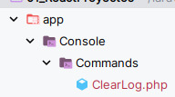

# Introducción a Artisan en Laravel

Artisan es la interfaz de línea de comandos (CLI) incluida con Laravel.    
Ofrece una variedad de comandos útiles para realizar tareas comunes de desarrollo y mantenimiento de aplicaciones.
La palabra artisan viene de artesano intentando reflejar la sencillez y eficiencia de su utilización

# Características principales

- **Generación de Código**: Artisan facilita la creación de modelos, controladores, y otras clases necesarias en aplicaciones Laravel.
- **Migraciones de Bases de Datos**: Permite manejar fácilmente las migraciones de bases de datos.
- **Tareas Programadas**: Proporciona una forma sencilla de programar tareas que deben ejecutarse periódicamente.
- **Entorno de Pruebas**: Ofrece comandos para ejecutar pruebas y otros chequeos.

Artisan es una herramienta esencial en el desarrollo de Laravel, que aumenta la eficiencia y simplifica muchas tareas de programación.
# Creando un comando en artisan
> Podemos crear comandos presonalizados para trabajar en nuestros proyectos. Para ello seguiremos las siguientes acciones
 

;Creamos un fichero con command con una clase para especificar el comando

php artisan make:command ClearLog




{}

# Ejemplo de Uso

Para ver una lista de todos los comandos disponibles, puedes ejecutar:

```bash
php_ artisan list
```
# Clasificación de los Principales Comandos de Artisan en Laravel
{}
## Clasificación de los Principales Comandos de Artisan en Laravel 
****

{}


Artisan, el CLI de Laravel, ofrece una amplia gama de comandos útiles. A continuación se presentan algunos de los comandos más importantes agrupados por su funcionalidad.

## Comandos de Generación de Código

Estos comandos ayudan en la creación rápida de clases comúnmente usadas.

- **Controladores**: `php artisan make:controller`
- **Modelos**: `php artisan make:model`
- **Migraciones**: `php artisan make:migration`
- **Seeders**: `php artisan make:seeder`
- **Factories**: `php artisan make:factory`
- **Eventos**: `php artisan make:event`
- **Listeners**: `php artisan make:listener`
- **Middlewares**: `php artisan make:middleware`

## Comandos de Base de Datos y Migraciones

Utilizados para gestionar bases de datos y ejecutar migraciones.

- **Ejecutar Migraciones**: `php artisan migrate`
- **Revertir Migraciones**: `php artisan migrate:rollback`
- **Refrescar Migraciones**: `php artisan migrate:refresh`
- **Resetear Migraciones**: `php artisan migrate:reset`

## Comandos de Tareas Programadas

Para manejar tareas programadas o cron jobs.

- **Ejecutar Tareas Programadas**: `php artisan schedule:run`

## Comandos de Caché

Estos comandos son útiles para gestionar diferentes tipos de caché.

- **Limpiar Caché**: `php artisan cache:clear`
- **Limpiar Caché de Configuración**: `php artisan config:clear`
- **Limpiar Caché de Rutas**: `php artisan route:clear`
- **Limpiar Caché de Vistas**: `php artisan view:clear`

## Comandos de Pruebas

Para ejecutar pruebas unitarias y de integración.

- **Ejecutar Pruebas**: `php artisan test`

## Comandos de Rutas

Para trabajar con rutas.

- **Listar Rutas**: `php artisan route:list`

## Otros Comandos Útiles

- **Limpiar Cache de la Aplicación**: `php artisan optimize`
- **Crear Enlace Simbólico para Almacenamiento**: `php artisan storage:link`
